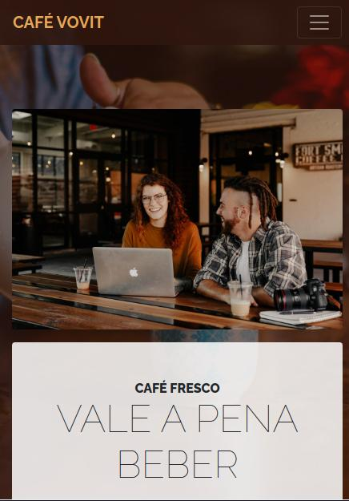

# Café Vovit

A melhor cafeteria Café Vovit do Brasil agora com seu web site bacaninha


Autor: Brenno


### Mobile




### Web

  


## Instalação

Crie o projeto Fake:

```sh
npx gatsby new <cafe-vovit-fake> https://gitlab.com/brennoclins/cafe-vovit
```

Depois de criado entre na pasta do projeto e execute os comandos:

```sh
cd cafe-vovit-fake
npm install
npx gatsby develop
```

### Personalização

Edite o `config.js` com os seus detalhes

```javascript
module.exports = {
  siteTitle: 'Café Vovit', // <title>
  ...
  heading: 'Café Vovit',
  subHeading: 'A Melhor cafeteria do Brasil',
};

```


